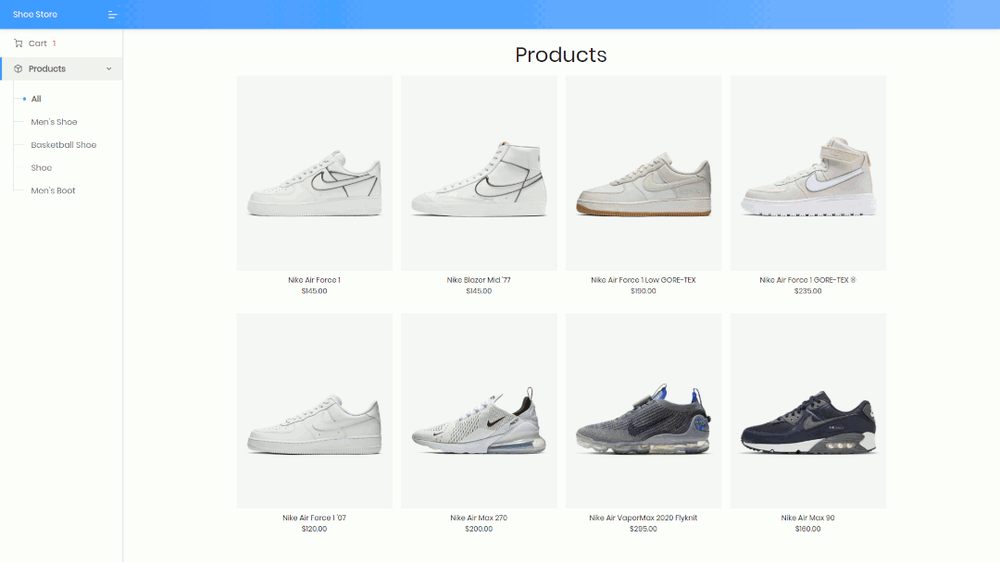
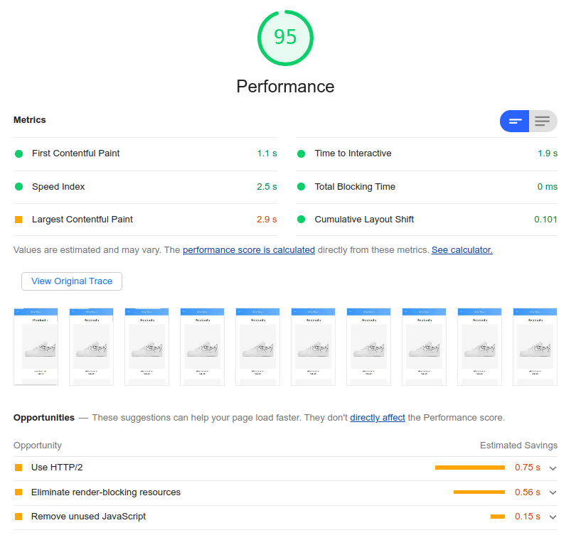
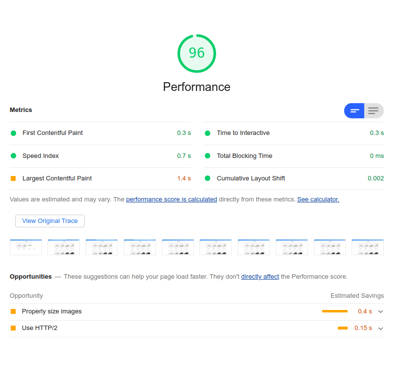

# 💎 Django e-commerce platform 💎

This project was created for educational purposes.

We enable clients to browse products, add them to the cart, apply discount codes,
go through the checkout process, pay with a credit card, and obtain an invoice.
Also, we implemented a recommendation engine to recommend products to customers.

## Preview

## What did we do?

* Python e-commerce platform based on Django framework.
* Web Crawler with Scrapy framework.
* PostgreSQL as RDBMS.
* Product catalog.
* Ajax infinite scroll.
* Shopping cart using Django sessions.
* Order management system with payment integration (Braintree).
* Generate PDF invoices dynamically.
* Sending asynchronous invoices to customers using Celery as a task manager and
RabbitMQ as a message broker.
* Export orders to CSV file.
* Custom order view for administration.
* Coupon system to apply discount.
* Product recommendation engine with Redis.
* Queryset optimization with `only()` and `Prefetch()`.
* Caching with memcached.
* Containerization with Docker.
* Caching static and media files with Nginx.
* Text compression with Nginx gzip.
* Optimized load page speed.

### Mobile page speed

### Desktop page speed

